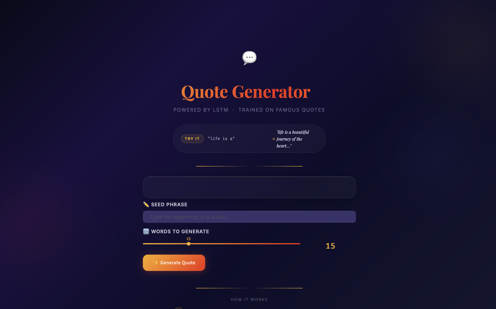
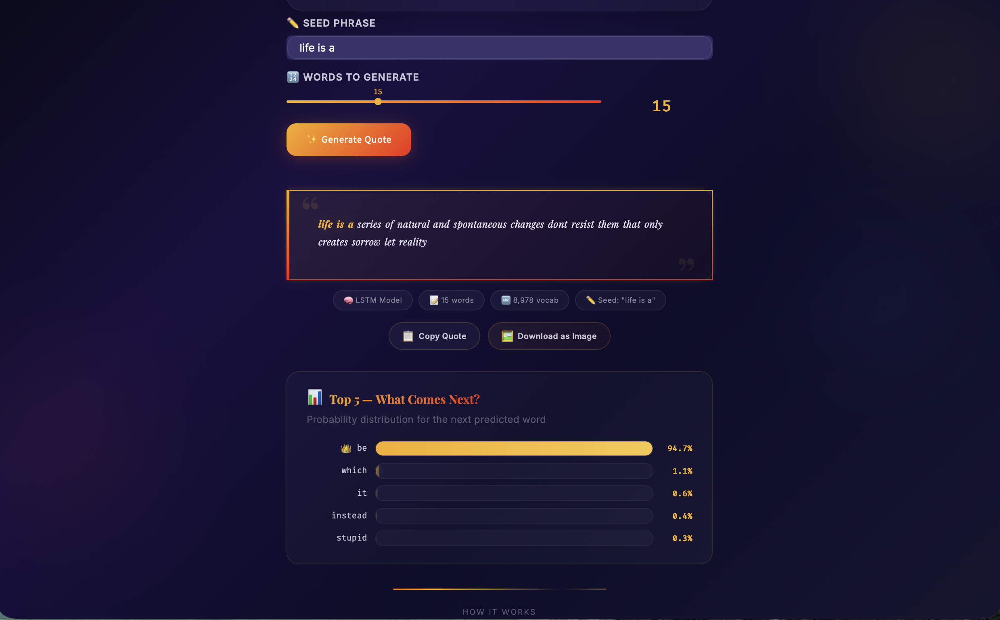
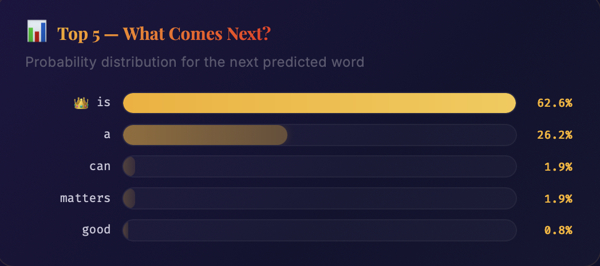

# 💬 Quote Generator — LSTM Neural Network

An AI-powered quote generator that uses a **Long Short-Term Memory (LSTM)** neural network trained on thousands of famous quotes. Type a seed phrase and watch the model predict the next words, one at a time, to compose a complete quote.


---

## ✨ Features

- **Next-Word Prediction** — LSTM model predicts the most probable next word from a ~9K word vocabulary
- **Top-5 Predictions Chart** — Animated horizontal bar chart showing the model's top 5 word candidates with confidence percentages
- **Copy & Download** — Copy generated quotes to clipboard or download as a high-res PNG image
- **Animated UI** — 15+ CSS keyframe animations (floating orbs, shimmer dividers, glow pulse, badge pop-in, gradient shifts)
- **Responsive Design** — Fully responsive across desktop, tablet (≤768px), mobile (≤480px), and small mobile (≤360px)
- **Example Seeds** — One-click example seed phrases to get started quickly

---

## 📸 Screenshots

> **To populate this section:** Take screenshots of your running app and save them in the `screenshots/` folder with the filenames below.

### Hero & Input


### Generated Quote Output


### Top-5 Predictions Chart


> 💡 **Quick way to capture:** Use the **Download as Image** button in the app to save the quote card directly. For full-page screenshots use macOS `Shift + Cmd + 4`.

---

## 🧠 Model Architecture

| Component | Detail |
|---|---|
| **Type** | LSTM (Long Short-Term Memory) |
| **Framework** | TensorFlow / Keras |
| **Embedding Dim** | 100 |
| **RNN Units** | 128 |
| **Vocabulary Size** | 8,978 words |
| **Max Sequence Length** | 745 tokens |
| **Training Epochs** | 100 |
| **Dataset** | Famous quotes (`quote_dataset.csv`) |
| **Output Layer** | Softmax (probability distribution over vocabulary) |

### Training Pipeline

The full training pipeline is documented in [`QuotePrediction.ipynb`](QuotePrediction.ipynb):

1. **Data Collection** — Load quotes from CSV dataset
2. **Preprocessing** — Tokenization using Keras `Tokenizer`, lowercasing, sequence generation
3. **Padding** — Pre-padding sequences to uniform length (`max_len = 745`)
4. **Model Training** — Both SimpleRNN (10 epochs) and LSTM (100 epochs) architectures were trained; LSTM was selected for production
5. **Artifacts Saved** — `lstm_model.h5`, `tokenizer.pkl`, `max_len.pkl`

---

## 📁 Project Structure

```
Predictor/
├── app.py                  # Streamlit web application
├── style.css               # CSS animations, layout & responsive design
├── lstm_model.h5           # Trained LSTM model weights
├── tokenizer.pkl           # Keras Tokenizer (serialized)
├── max_len.pkl             # Max sequence length (serialized)
├── QuotePrediction.ipynb   # Training notebook (36 cells)
├── .streamlit/
│   └── config.toml         # Streamlit theme & server config
├── .gitignore
└── README.md
```

---

## 🚀 Getting Started

### Prerequisites

- Python 3.10+
- pip

### Installation

```bash
# Clone the repository
git clone https://github.com/<your-username>/quote-generator.git
cd quote-generator

# Create virtual environment
python -m venv .venv
source .venv/bin/activate        # macOS/Linux
# .venv\Scripts\activate         # Windows

# Install dependencies
pip install streamlit tensorflow numpy
```

### Run the App

```bash
streamlit run app.py --server.port 8501
```

Open [http://localhost:8501](http://localhost:8501) in your browser.

---

## 🛠️ Tech Stack

| Layer | Technology |
|---|---|
| **ML Framework** | TensorFlow 2.20 / Keras 3.13 |
| **Web Framework** | Streamlit 1.54 |
| **Language** | Python 3.12 |
| **Numerical** | NumPy 2.4 |
| **Serialization** | Pickle (tokenizer, max_len) |
| **Image Export** | html2canvas (CDN) |
| **Fonts** | Playfair Display, Inter, Fira Code (Google Fonts) |

---

## 🎨 UI Highlights

- **Dark theme** with gradient background and floating ambient orbs
- **Glass-morphism cards** with backdrop blur and shimmer borders
- **Quote output** with decorative quotation marks and glow-pulse animation
- **Top-5 chart** with animated bar growth, gold/silver ranking, and staggered fade-in
- **Copy/Download actions** with success state feedback (green flash)
- **Touch-optimized** — hover effects disabled on touch devices, enlarged tap targets

---

## 📊 How It Works

1. **Seed Phrase** — User types the beginning of a thought (e.g., *"life is a"*)
2. **Prediction Loop** — The LSTM takes the input sequence, passes it through embedding → LSTM → dense layers, and outputs a probability distribution over the vocabulary
3. **Word Selection** — The word with the highest probability (`argmax`) is appended to the sequence
4. **Iteration** — Steps 2–3 repeat for the requested number of words
5. **Top-5 Chart** — After generation, the model's final softmax output is displayed as a ranked bar chart

---

## 📝 License

This project is open source and available under the [MIT License](LICENSE).

---

<p align="center">
  Built with ❤️ using <a href="https://streamlit.io">Streamlit</a> &nbsp;·&nbsp; LSTM Quote Predictor
</p>
